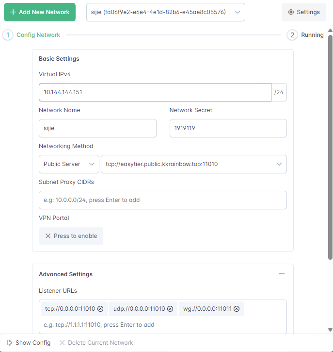
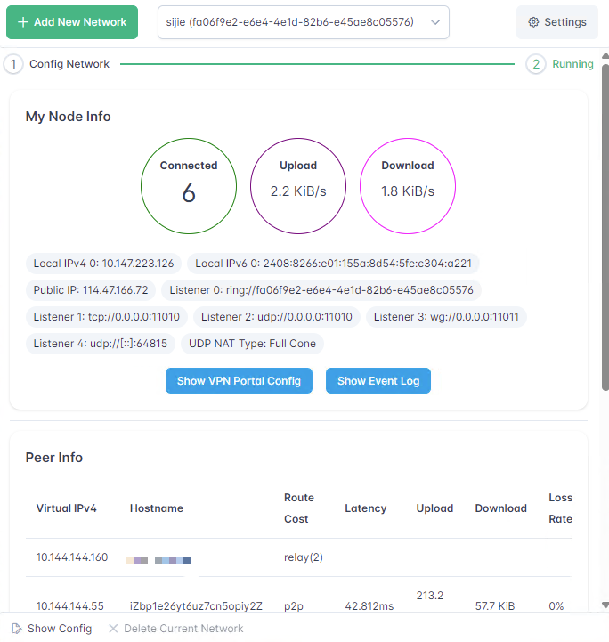
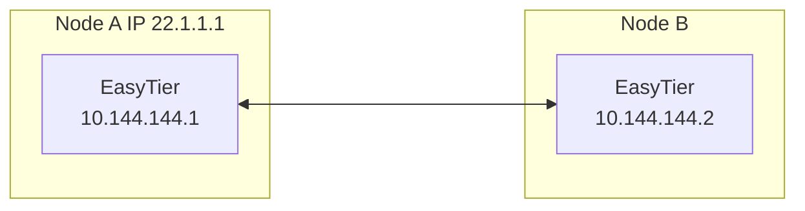
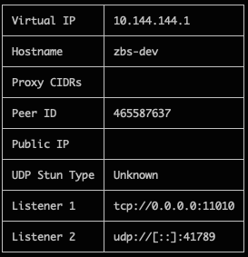
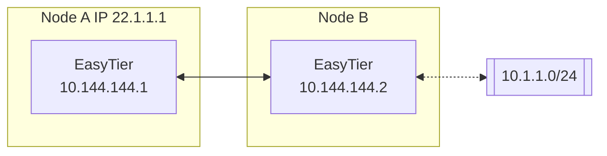
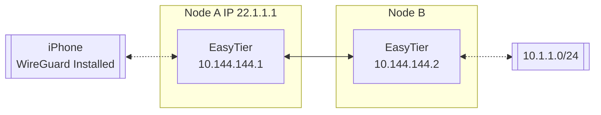

# EasyTier

[](https://github.com/EasyTier/EasyTier/blob/main/LICENSE)
[](https://github.com/EasyTier/EasyTier/commits/main)
[](https://github.com/EasyTier/EasyTier/issues)
[](https://github.com/EasyTier/EasyTier/actions/workflows/core.yml)
[](https://github.com/EasyTier/EasyTier/actions/workflows/gui.yml)

[简体中文](/README_CN.md) | [English](/README.md)

**Please visit the [EasyTier Official Website](https://www.easytier.top/en/) to view the full documentation.**

EasyTier is a simple, safe and decentralized VPN networking solution implemented with the Rust language and Tokio framework.

<p align="center">


</p>

## Features

- **Decentralized**: No need to rely on centralized services, nodes are equal and independent.
- **Safe**: Use WireGuard protocol to encrypt data.
- **High Performance**: Full-link zero-copy, with performance comparable to mainstream networking software.
- **Cross-platform**: Supports MacOS/Linux/Windows/Android, will support IOS in the future. The executable file is statically linked, making deployment simple.
- **Networking without public IP**: Supports networking using shared public nodes, refer to [Configuration Guide](#Networking-without-public-IP)
- **NAT traversal**: Supports UDP-based NAT traversal, able to establish stable connections even in complex network environments.
- **Subnet Proxy (Point-to-Network)**: Nodes can expose accessible network segments as proxies to the VPN subnet, allowing other nodes to access these subnets through the node.
- **Smart Routing**: Selects links based on traffic to reduce latency and increase throughput.
- **TCP Support**: Provides reliable data transmission through concurrent TCP links when UDP is limited, optimizing performance.
- **High Availability**: Supports multi-path and switches to healthy paths when high packet loss or network errors are detected.
- **IPv6 Support**: Supports networking using IPv6.
- **Multiple Protocol Types**: Supports communication between nodes using protocols such as WebSocket and QUIC.
- **Web Management Interface**: Provides a [web-based management](https://easytier.cn/web) interface for easy configuration and monitoring.

## Installation

1. **Download the precompiled binary file**

    Visit the [GitHub Release page](https://github.com/EasyTier/EasyTier/releases) to download the binary file suitable for your operating system. Release includes both command-line programs and GUI programs in the compressed package.

2. **Install via crates.io**

    ```sh
    cargo install easytier
    ```

3. **Install from source code**

    ```sh
    cargo install --git https://github.com/EasyTier/EasyTier.git easytier
    ```

4. **Install by Docker Compose**

    Please visit the [EasyTier Official Website](https://www.easytier.cn/en/) to view the full documentation.

5. **Install by script (For Linux Only)**

    ```sh
    wget -O /tmp/easytier.sh "https://raw.githubusercontent.com/EasyTier/EasyTier/main/script/install.sh" && bash /tmp/easytier.sh install
    ```

    You can also uninstall/update Easytier by the command "uninstall" or "update" of this script

6. **Install by Homebrew (For MacOS Only)**

    ```sh
    brew tap brewforge/chinese
    brew install --cask easytier
    ```

## Quick Start

> The following text only describes the use of the command-line tool; the GUI program can be configured by referring to the following concepts.

Make sure EasyTier is installed according to the [Installation Guide](#Installation), and both easytier-core and easytier-cli commands are available.

### Two-node Networking

Assuming the network topology of the two nodes is as follows



1. Execute on Node A:

    ```sh
    sudo easytier-core --ipv4 10.144.144.1
    ```

    Successful execution of the command will print the following.

    

2. Execute on Node B

    ```sh
    sudo easytier-core --ipv4 10.144.144.2 --peers udp://22.1.1.1:11010
    ```

3. Test Connectivity

    The two nodes should connect successfully and be able to communicate within the virtual subnet

    ```sh
    ping 10.144.144.2
    ```

    Use easytier-cli to view node information in the subnet

    ```sh
    easytier-cli peer
    ```

    

    ```sh
    easytier-cli route
    ```

    


    ```sh
    easytier-cli node
    ```

    

---

### Multi-node Networking

Based on the two-node networking example just now, if more nodes need to join the virtual network, you can use the following command.

```sh
sudo easytier-core --ipv4 10.144.144.2 --peers udp://22.1.1.1:11010
```

The `--peers` parameter can fill in the listening address of any node already in the virtual network.

---

### Subnet Proxy (Point-to-Network) Configuration

Assuming the network topology is as follows, Node B wants to share its accessible subnet 10.1.1.0/24 with other nodes.



Then the startup parameters for Node B's easytier are (new -n parameter)

```sh
sudo easytier-core --ipv4 10.144.144.2 -n 10.1.1.0/24
```

Subnet proxy information will automatically sync to each node in the virtual network, and each node will automatically configure the corresponding route. Node A can check whether the subnet proxy is effective through the following command.

1. Check whether the routing information has been synchronized, the proxy_cidrs column shows the proxied subnets.

    ```sh
    easytier-cli route
    ```

   

2. Test whether Node A can access nodes under the proxied subnet

    ```sh
    ping 10.1.1.2
    ```

---

### Networking without Public IP

EasyTier supports networking using shared public nodes. The currently deployed shared public node is ``tcp://public.easytier.cn:11010``.

When using shared nodes, each node entering the network needs to provide the same ``--network-name`` and ``--network-secret`` parameters as the unique identifier of the network.

Taking two nodes as an example, Node A executes:

```sh
sudo easytier-core -i 10.144.144.1 --network-name abc --network-secret abc -p tcp://public.easytier.cn:11010
```

Node B executes

```sh
sudo easytier-core --ipv4 10.144.144.2 --network-name abc --network-secret abc -p tcp://public.easytier.cn:11010
```

After the command is successfully executed, Node A can access Node B through the virtual IP 10.144.144.2.

### Use EasyTier with WireGuard Client

EasyTier can be used as a WireGuard server to allow any device with WireGuard client installed to access the EasyTier network. For platforms currently unsupported by EasyTier (such as iOS, Android, etc.), this method can be used to connect to the EasyTier network.

Assuming the network topology is as follows:



To enable an iPhone to access the EasyTier network through Node A, the following configuration can be applied:

Include the --vpn-portal parameter in the easytier-core command on Node A to specify the port that the WireGuard service listens on and the subnet used by the WireGuard network.

```sh
# The following parameters mean: listen on port 0.0.0.0:11013, and use the 10.14.14.0/24 subnet for WireGuard
sudo easytier-core --ipv4 10.144.144.1 --vpn-portal wg://0.0.0.0:11013/10.14.14.0/24
```

After successfully starting easytier-core, use easytier-cli to obtain the WireGuard client configuration.

```sh
$> easytier-cli vpn-portal
portal_name: wireguard

############### client_config_start ###############

[Interface]
PrivateKey = 9VDvlaIC9XHUvRuE06hD2CEDrtGF+0lDthgr9SZfIho=
Address = 10.14.14.0/32 # should assign an ip from this cidr manually

[Peer]
PublicKey = zhrZQg4QdPZs8CajT3r4fmzcNsWpBL9ImQCUsnlXyGM=
AllowedIPs = 10.144.144.0/24,10.14.14.0/24
Endpoint = 0.0.0.0:11013 # should be the public ip(or domain) of the vpn server
PersistentKeepalive = 25

############### client_config_end ###############

connected_clients:
[]
```

Before using the Client Config, you need to modify the Interface Address and Peer Endpoint to the client's IP and the IP of the EasyTier node, respectively. Import the configuration file into the WireGuard client to access the EasyTier network.

### Self-Hosted Public Server

Every virtual network (with same network name and secret) can act as a public server cluster. Nodes of other network can connect to arbitrary nodes in public server cluster to discover each other without public IP.

Run you own public server cluster is exactly same as running an virtual network, except that you can skip config the ipv4 addr.

You can also join the official public server cluster with following command:

```
sudo easytier-core --network-name easytier --network-secret easytier -p tcp://public.easytier.cn:11010
```


### Configurations

You can use ``easytier-core --help`` to view all configuration items

## Roadmap

- [ ] Support features such TCP hole punching, KCP, FEC etc.
- [ ] Support iOS.

## Community and Contribution

We welcome and encourage community contributions! If you want to get involved, please submit a [GitHub PR](https://github.com/EasyTier/EasyTier/pulls). Detailed contribution guidelines can be found in [CONTRIBUTING.md](https://github.com/EasyTier/EasyTier/blob/main/CONTRIBUTING.md).

## Related Projects and Resources

- [ZeroTier](https://www.zerotier.com/): A global virtual network for connecting devices.
- [TailScale](https://tailscale.com/): A VPN solution aimed at simplifying network configuration.
- [vpncloud](https://github.com/dswd/vpncloud): A P2P Mesh VPN
- [Candy](https://github.com/lanthora/candy): A reliable, low-latency, and anti-censorship virtual private network

## License

EasyTier is released under the [Apache License 2.0](https://github.com/EasyTier/EasyTier/blob/main/LICENSE).

## Contact

- Ask questions or report problems: [GitHub Issues](https://github.com/EasyTier/EasyTier/issues)
- Discussion and exchange: [GitHub Discussions](https://github.com/EasyTier/EasyTier/discussions)
- Telegram：https://t.me/easytier
- QQ Group: 949700262

## Sponsor


