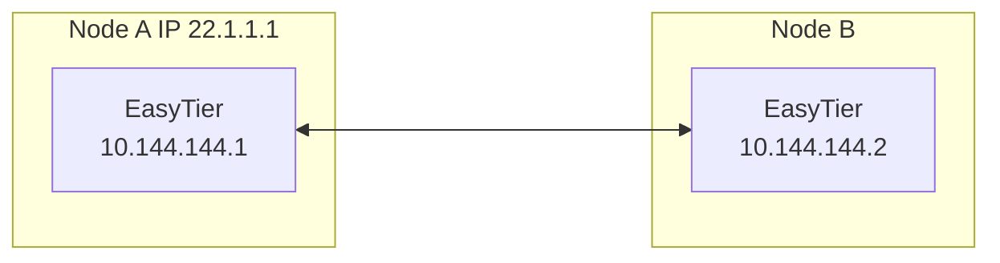
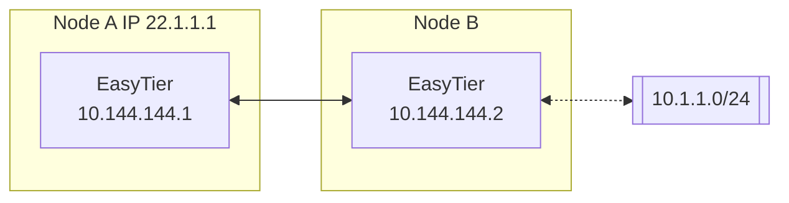
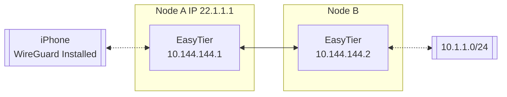

# EasyTier

[](https://github.com/EasyTier/EasyTier/releases)
[](https://github.com/EasyTier/EasyTier/blob/main/LICENSE)
[](https://github.com/EasyTier/EasyTier/commits/main)
[](https://github.com/EasyTier/EasyTier/issues)
[](https://github.com/EasyTier/EasyTier/actions/workflows/core.yml)
[](https://github.com/EasyTier/EasyTier/actions/workflows/gui.yml)
[](https://github.com/EasyTier/EasyTier/actions/workflows/test.yml)
[](https://deepwiki.com/EasyTier/EasyTier)

[简体中文](/README_CN.md) | [English](/README.md)

> ✨ A simple, secure, decentralized networking solution powered by Rust and Tokio

<p align="center">


</p>

📚 **[Documentation](https://easytier.cn/en/)** | 🖥️ **[Web Console](https://easytier.cn/web)** | 💬 **[Community](https://github.com/EasyTier/EasyTier/discussions)** | 📝 **[Changelog](https://easytier.cn/en/changelog)**

## Features

### Core Features
- 🔒 **Decentralized**: Nodes are equal and independent, no centralized services required
- 🚀 **Easy to Use**: Multiple operation methods via web, client, and command line
- 🌍 **Cross-Platform**: Supports Win/MacOS/Linux/FreeBSD/Android and X86/ARM/MIPS architectures
- 🔐 **Secure**: AES-GCM or WireGuard encryption, prevents man-in-the-middle attacks

### Advanced Capabilities
- 🔌 **Efficient NAT Traversal**: Supports UDP and IPv6 traversal, works with NAT4-NAT4 networks
- 🌐 **Subnet Proxy**: Nodes can share subnets for other nodes to access
- 🔄 **Intelligent Routing**: Latency priority and automatic route selection for best network experience
- ⚡ **High Performance**: Zero-copy throughout the entire link, supports TCP/UDP/WSS/WG protocols

### Network Optimization
- 📊 **UDP Loss Resistance**: KCP/QUIC proxy optimizes latency and bandwidth in high packet loss environments
- 🔧 **Web Management**: Easy configuration and monitoring through web interface
- 🛠 **Zero Config**: Simple deployment with statically linked executables

## Quick Start

### 📥 Installation

Choose the installation method that best suits your needs:

```bash
# 1. Download pre-built binary (Recommended)
# Visit https://github.com/EasyTier/EasyTier/releases

# 2. Install via cargo
cargo install easytier

# 3. Install via Docker Compose
# See https://easytier.cn/en/ for Docker instructions

# 4. Linux Quick Install
wget -O- https://raw.githubusercontent.com/EasyTier/EasyTier/main/script/install.sh | sudo bash

# 5. MacOS via Homebrew
brew tap brewforge/chinese
brew install --cask easytier-gui
```

### 🚀 Basic Usage

1. **Start First Node**
```bash
sudo easytier-core --ipv4 10.144.144.1
```

2. **Connect Second Node**
```bash
sudo easytier-core --ipv4 10.144.144.2 --peers udp://FIRST_NODE_IP:11010
```

3. **Verify Connection**
```bash
ping 10.144.144.2
easytier-cli peer  # View connected peers
```

### 🔍 Advanced Features

- **[Subnet Proxy Guide](https://easytier.cn/en/docs/advanced/subnet-proxy)**
- **[WireGuard Integration](https://easytier.cn/en/docs/advanced/wireguard)**
- **[Public Node Setup](https://easytier.cn/en/docs/advanced/public-node)**

📚 **[View Full Documentation](https://easytier.cn/en/)**

## Two-node Networking

Assuming the network topology of the two nodes is as follows



1. Execute on Node A:

    ```sh
    sudo easytier-core --ipv4 10.144.144.1
    ```

    Successful execution of the command will print the following.

    

2. Execute on Node B

    ```sh
    sudo easytier-core --ipv4 10.144.144.2 --peers udp://22.1.1.1:11010
    ```

3. Test Connectivity

    The two nodes should connect successfully and be able to communicate within the virtual subnet

    ```sh
    ping 10.144.144.2
    ```

    Use easytier-cli to view node information in the subnet

    ```sh
    easytier-cli peer
    ```

    

    ```sh
    easytier-cli route
    ```

    


    ```sh
    easytier-cli node
    ```

    

---

### Multi-node Networking

Based on the two-node networking example just now, if more nodes need to join the virtual network, you can use the following command.

```sh
sudo easytier-core --ipv4 10.144.144.2 --peers udp://22.1.1.1:11010
```

The `--peers` parameter can fill in the listening address of any node already in the virtual network.

---

### Subnet Proxy (Point-to-Network) Configuration

Assuming the network topology is as follows, Node B wants to share its accessible subnet 10.1.1.0/24 with other nodes.



Then the startup parameters for Node B's easytier are (new -n parameter)

```sh
sudo easytier-core --ipv4 10.144.144.2 -n 10.1.1.0/24
```

Subnet proxy information will automatically sync to each node in the virtual network, and each node will automatically configure the corresponding route. Node A can check whether the subnet proxy is effective through the following command.

1. Check whether the routing information has been synchronized, the proxy_cidrs column shows the proxied subnets.

    ```sh
    easytier-cli route
    ```

   

2. Test whether Node A can access nodes under the proxied subnet

    ```sh
    ping 10.1.1.2
    ```

---

### Networking without Public IP

EasyTier supports networking using shared public nodes. The currently deployed shared public node is ``tcp://public.easytier.cn:11010``.

When using shared nodes, each node entering the network needs to provide the same ``--network-name`` and ``--network-secret`` parameters as the unique identifier of the network.

Taking two nodes as an example, Node A executes:

```sh
sudo easytier-core -i 10.144.144.1 --network-name abc --network-secret abc -p tcp://public.easytier.cn:11010
```

Node B executes

```sh
sudo easytier-core --ipv4 10.144.144.2 --network-name abc --network-secret abc -p tcp://public.easytier.cn:11010
```

After the command is successfully executed, Node A can access Node B through the virtual IP 10.144.144.2.

### Use EasyTier with WireGuard Client

EasyTier can be used as a WireGuard server to allow any device with WireGuard client installed to access the EasyTier network. For platforms currently unsupported by EasyTier (such as iOS, Android, etc.), this method can be used to connect to the EasyTier network.

Assuming the network topology is as follows:



To enable an iPhone to access the EasyTier network through Node A, the following configuration can be applied:

Include the --vpn-portal parameter in the easytier-core command on Node A to specify the port that the WireGuard service listens on and the subnet used by the WireGuard network.

```sh
# The following parameters mean: listen on port 0.0.0.0:11013, and use the 10.14.14.0/24 subnet for WireGuard
sudo easytier-core --ipv4 10.144.144.1 --vpn-portal wg://0.0.0.0:11013/10.14.14.0/24
```

After successfully starting easytier-core, use easytier-cli to obtain the WireGuard client configuration.

```sh
$> easytier-cli vpn-portal
portal_name: wireguard

############### client_config_start ###############

[Interface]
PrivateKey = 9VDvlaIC9XHUvRuE06hD2CEDrtGF+0lDthgr9SZfIho=
Address = 10.14.14.0/32 # should assign an ip from this cidr manually

[Peer]
PublicKey = zhrZQg4QdPZs8CajT3r4fmzcNsWpBL9ImQCUsnlXyGM=
AllowedIPs = 10.144.144.0/24,10.14.14.0/24
Endpoint = 0.0.0.0:11013 # should be the public ip(or domain) of the vpn server
PersistentKeepalive = 25

############### client_config_end ###############

connected_clients:
[]
```

Before using the Client Config, you need to modify the Interface Address and Peer Endpoint to the client's IP and the IP of the EasyTier node, respectively. Import the configuration file into the WireGuard client to access the EasyTier network.

### Self-Hosted Public Server

Every virtual network (with same network name and secret) can act as a public server cluster. Nodes of other network can connect to arbitrary nodes in public server cluster to discover each other without public IP.

Run you own public server cluster is exactly same as running an virtual network, except that you can skip config the ipv4 addr.

You can also join the official public server cluster with following command:

```
sudo easytier-core --network-name easytier --network-secret easytier -p tcp://public.easytier.cn:11010
```


### Configurations

You can use ``easytier-core --help`` to view all configuration items

## Related Links

- 📖 **[Community Documentation](https://easytier.cn/en/docs)**: Maintained by community volunteers, a plain language guide to using EasyTier
- 🌐 **[Public Server Node List](https://easytier.cn/en/nodes)**: Community-maintained list of public server nodes and status queries
- 💬 **[Telegram Group](https://t.me/easytier)**
- 👥 **[QQ Group: 949700262](https://qm.qq.com/cgi-bin/qm/qr?k=kC8YJ6Jb8vWJIDbZrZJB8pB5YZgPJA5-)**

## Acknowledgments

Special thanks to Langlang Cloud for sponsoring our public servers.

## License

EasyTier is released under the [Apache License 2.0](https://github.com/EasyTier/EasyTier/blob/main/LICENSE).

## Sponsor

If you find EasyTier helpful, please consider sponsoring us. Software development and maintenance require a lot of time and effort, and your sponsorship will help us better maintain and improve EasyTier.

<p align="center">


</p>
