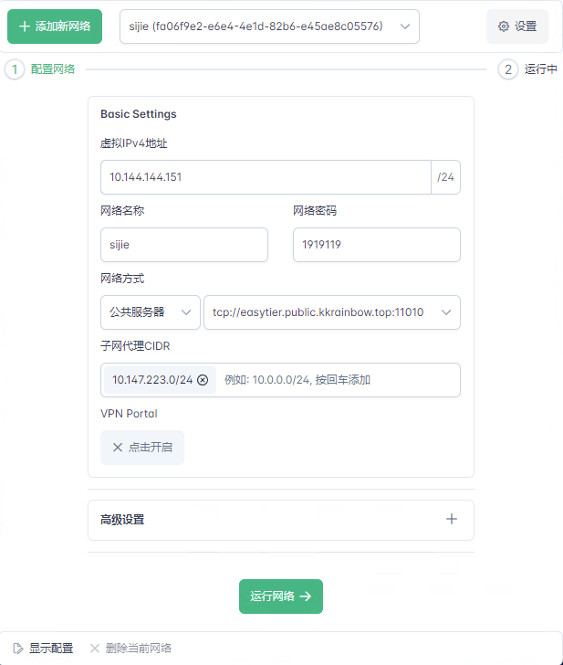
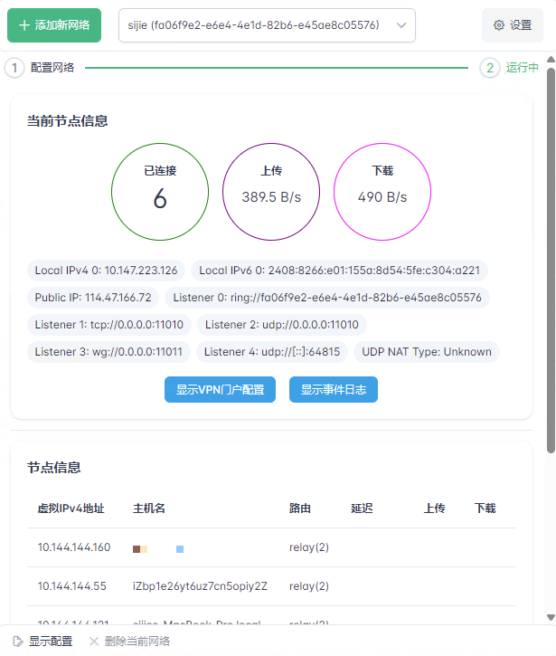
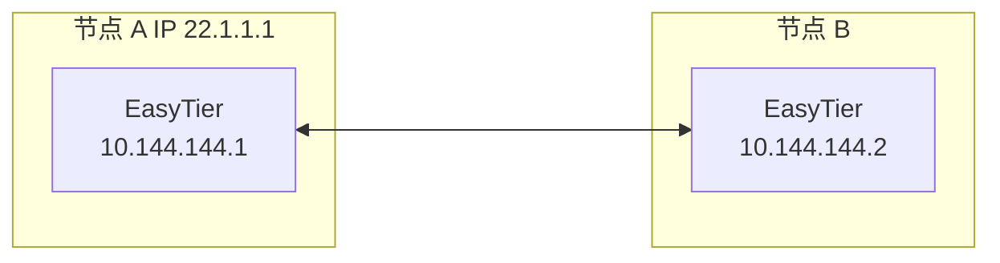
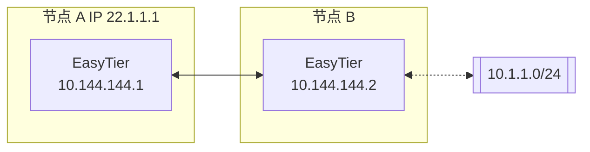
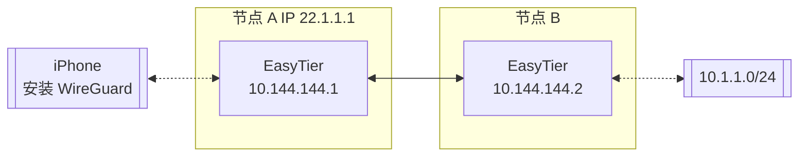

# EasyTier

[](https://github.com/EasyTier/EasyTier/blob/main/LICENSE)
[](https://github.com/EasyTier/EasyTier/commits/main)
[](https://github.com/EasyTier/EasyTier/issues)
[](https://github.com/EasyTier/EasyTier/actions/workflows/core.yml)
[](https://github.com/EasyTier/EasyTier/actions/workflows/gui.yml)

[简体中文](/README_CN.md) | [English](/README.md)

**请访问 [EasyTier 官网](https://www.easytier.cn/) 以查看完整的文档。**

一个简单、安全、去中心化的内网穿透 VPN 组网方案，使用 Rust 语言和 Tokio 框架实现。

<p align="center">


</p>

## 特点

- **去中心化**：无需依赖中心化服务，节点平等且独立。
- **安全**：支持利用 WireGuard 加密通信，也支持 AES-GCM 加密保护中转流量。
- **高性能**：全链路零拷贝，性能与主流组网软件相当。
- **跨平台**：支持 MacOS/Linux/Windows/Android，未来将支持 IOS。可执行文件静态链接，部署简单。
- **无公网 IP 组网**：支持利用共享的公网节点组网，可参考 [配置指南](#无公网IP组网)
- **NAT 穿透**：支持基于 UDP 的 NAT 穿透，即使在复杂的网络环境下也能建立稳定的连接。
- **子网代理（点对网）**：节点可以将可访问的网段作为代理暴露给 VPN 子网，允许其他节点通过该节点访问这些子网。
- **智能路由**：根据流量智能选择链路，减少延迟，提高吞吐量。
- **TCP 支持**：在 UDP 受限的情况下，通过并发 TCP 链接提供可靠的数据传输，优化性能。
- **高可用性**：支持多路径和在检测到高丢包率或网络错误时切换到健康路径。
- **IPV6 支持**：支持利用 IPV6 组网。
- **多协议类型**: 支持使用 WebSocket、QUIC 等协议进行节点间通信。
- **Web 管理界面**：支持通过 [Web 界面](https://easytier.cn)管理节点。

## 安装

1. **下载预编译的二进制文件**

    访问 [GitHub Release 页面](https://github.com/EasyTier/EasyTier/releases) 下载适用于您操作系统的二进制文件。Release 压缩包中同时包含命令行程序和图形界面程序。

2. **通过 crates.io 安装**

    ```sh
    cargo install easytier
    ```

3. **通过源码安装**

    ```sh
    cargo install --git https://github.com/EasyTier/EasyTier.git easytier
    ```

4. **通过Docker Compose安装**

    请访问 [EasyTier 官网](https://www.easytier.cn/) 以查看完整的文档。

5. **使用一键脚本安装 (仅适用于 Linux)**

    ```sh
    wget -O /tmp/easytier.sh "https://raw.githubusercontent.com/EasyTier/EasyTier/main/script/install.sh" && bash /tmp/easytier.sh install
    ```

    使用本脚本安装的 Easytier 可以使用脚本的 uninstall/update 对其卸载/升级

6. **使用 Homebrew 安装 (仅适用于 MacOS)**

    ```sh
    brew tap brewforge/chinese
    brew install --cask easytier
    ```

## 快速开始

> 下文仅描述命令行工具的使用，图形界面程序可参考下述概念自行配置。

确保已按照 [安装指南](#安装) 安装 EasyTier，并且 easytier-core 和 easytier-cli 两个命令都已经可用。

### 双节点组网

假设双节点的网络拓扑如下



1. 在节点 A 上执行：

    ```sh
    sudo easytier-core --ipv4 10.144.144.1
    ```

    命令执行成功会有如下打印。

    

2. 在节点 B 执行

    ```sh
    sudo easytier-core --ipv4 10.144.144.2 --peers udp://22.1.1.1:11010
    ```

3. 测试联通性

    两个节点应成功连接并能够在虚拟子网内通信

    ```sh
    ping 10.144.144.2
    ```

    使用 easytier-cli 查看子网中的节点信息

    ```sh
    easytier-cli peer
    ```

    

    ```sh
    easytier-cli route
    ```

    

    ```sh
    easytier-cli node
    ```

    

---

### 多节点组网

基于刚才的双节点组网例子，如果有更多的节点需要加入虚拟网络，可以使用如下命令。

```sh
sudo easytier-core --ipv4 10.144.144.2 --peers udp://22.1.1.1:11010
```

其中 `--peers` 参数可以填写任意一个已经在虚拟网络中的节点的监听地址。

---

### 子网代理（点对网）配置

假设网络拓扑如下，节点 B 想将其可访问的子网 10.1.1.0/24 共享给其他节点。



则节点 B 的 easytier 启动参数为（新增 -n 参数）

```sh
sudo easytier-core --ipv4 10.144.144.2 -n 10.1.1.0/24
```

子网代理信息会自动同步到虚拟网络的每个节点，各个节点会自动配置相应的路由，节点 A 可以通过如下命令检查子网代理是否生效。

1. 检查路由信息是否已经同步，proxy_cidrs 列展示了被代理的子网。

    ```sh
    easytier-cli route
    ```

    

2. 测试节点 A 是否可访问被代理子网下的节点

    ```sh
    ping 10.1.1.2
    ```

---

### 无公网IP组网

EasyTier 支持共享公网节点进行组网。目前已部署共享的公网节点 ``tcp://public.easytier.cn:11010``。

使用共享节点时，需要每个入网节点提供相同的 ``--network-name`` 和 ``--network-secret`` 参数，作为网络的唯一标识。

以双节点为例，节点 A 执行：

```sh
sudo easytier-core -i 10.144.144.1 --network-name abc --network-secret abc -p tcp://public.easytier.cn:11010
```

节点 B 执行

```sh
sudo easytier-core --ipv4 10.144.144.2 --network-name abc --network-secret abc -p tcp://public.easytier.cn:11010
```

命令执行成功后，节点 A 即可通过虚拟 IP 10.144.144.2 访问节点 B。

---

### 使用 WireGuard 客户端接入

EasyTier 可以用作 WireGuard 服务端，让任意安装了 WireGuard 客户端的设备访问 EasyTier 网络。对于目前 EasyTier 不支持的平台 （如 iOS、Android 等），可以使用这种方式接入 EasyTier 网络。

假设网络拓扑如下：



我们需要 iPhone 通过节点 A 访问 EasyTier 网络，则可进行如下配置：

在节点 A 的 easytier-core 命令中，加入 --vpn-portal 参数，指定 WireGuard 服务监听的端口，以及 WireGuard 网络使用的网段。

```sh
# 以下参数的含义为： 监听 0.0.0.0:11013 端口，WireGuard 使用 10.14.14.0/24 网段
sudo easytier-core --ipv4 10.144.144.1 --vpn-portal wg://0.0.0.0:11013/10.14.14.0/24
```

easytier-core 启动成功后，使用 easytier-cli 获取 WireGuard Client 的配置。

```sh
$> easytier-cli vpn-portal
portal_name: wireguard

############### client_config_start ###############

[Interface]
PrivateKey = 9VDvlaIC9XHUvRuE06hD2CEDrtGF+0lDthgr9SZfIho=
Address = 10.14.14.0/32 # should assign an ip from this cidr manually

[Peer]
PublicKey = zhrZQg4QdPZs8CajT3r4fmzcNsWpBL9ImQCUsnlXyGM=
AllowedIPs = 10.144.144.0/24,10.14.14.0/24
Endpoint = 0.0.0.0:11013 # should be the public ip(or domain) of the vpn server
PersistentKeepalive = 25

############### client_config_end ###############

connected_clients:
[]
```

使用 Client Config 前，需要将 Interface Address 和 Peer Endpoint 分别修改为客户端的 IP 和 EasyTier 节点的 IP。将配置文件导入 WireGuard 客户端，即可访问 EasyTier 网络。

---

### 自建公共中转服务器

每个虚拟网络（通过相同的网络名称和密钥建链）都可以充当公共服务器集群。其他网络的节点可以连接到公共服务器集群中的任意节点，无需公共 IP 即可发现彼此。

运行自建的公共服务器集群与运行虚拟网络完全相同，不过可以跳过配置 ipv4 地址。

也可以使用以下命令加入官方公共服务器集群，后续将实现公共服务器集群的节点间负载均衡：

```
sudo easytier-core --network-name easytier --network-secret easytier -p tcp://public.easytier.cn:11010
```

### 其他配置

可使用 ``easytier-core --help`` 查看全部配置项

## 路线图

- [ ] 完善文档和用户指南。
- [ ] 支持 TCP 打洞、KCP、FEC 等特性。
- [ ] 支持 iOS。

## 社区和贡献

我们欢迎并鼓励社区贡献！如果你想参与进来，请提交 [GitHub PR](https://github.com/EasyTier/EasyTier/pulls)。详细的贡献指南可以在 [CONTRIBUTING.md](https://github.com/EasyTier/EasyTier/blob/main/CONTRIBUTING.md) 中找到。

## 相关项目和资源

- [ZeroTier](https://www.zerotier.com/): 一个全球虚拟网络，用于连接设备。
- [TailScale](https://tailscale.com/): 一个旨在简化网络配置的 VPN 解决方案。
- [vpncloud](https://github.com/dswd/vpncloud): 一个 P2P Mesh VPN
- [Candy](https://github.com/lanthora/candy): 可靠、低延迟、抗审查的虚拟专用网络

## 许可证

EasyTier 根据 [Apache License 2.0](https://github.com/EasyTier/EasyTier/blob/main/LICENSE) 许可证发布。

## 联系方式

- 提问或报告问题：[GitHub Issues](https://github.com/EasyTier/EasyTier/issues)
- 讨论和交流：[GitHub Discussions](https://github.com/EasyTier/EasyTier/discussions)
- QQ 群： 949700262
- Telegram：https://t.me/easytier

## 赞助


