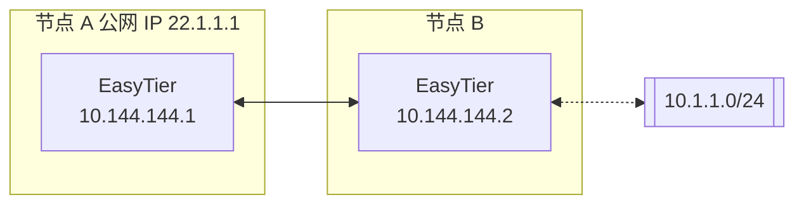
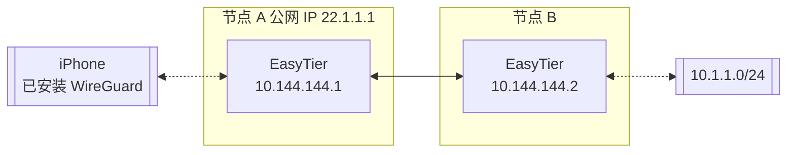

# EasyTier

[](https://github.com/EasyTier/EasyTier/releases)
[](https://github.com/EasyTier/EasyTier/blob/main/LICENSE)
[](https://github.com/EasyTier/EasyTier/commits/main)
[](https://github.com/EasyTier/EasyTier/issues)
[](https://github.com/EasyTier/EasyTier/actions/workflows/core.yml)
[](https://github.com/EasyTier/EasyTier/actions/workflows/gui.yml)
[](https://github.com/EasyTier/EasyTier/actions/workflows/test.yml)
[](https://deepwiki.com/EasyTier/EasyTier)

[简体中文](/README_CN.md) | [English](/README.md)

> ✨ 一个由 Rust 和 Tokio 驱动的简单、安全、去中心化的异地组网方案

<p align="center">


</p>

📚 **[完整文档](https://easytier.cn)** | 🖥️ **[Web 控制台](https://easytier.cn/web)** | 📝 **[下载发布版本](https://github.com/EasyTier/EasyTier/releases)** | 🧩 **[第三方工具](https://easytier.cn/guide/installation_gui.html#%E7%AC%AC%E4%B8%89%E6%96%B9%E5%9B%BE%E5%BD%A2%E7%95%8C%E9%9D%A2)** | ❤️ **[赞助](#赞助)**

## 特性

### 核心特性

- 🔒 **去中心化**：节点平等且独立，无需中心化服务
- 🚀 **易于使用**：支持通过网页、客户端和命令行多种操作方式
- 🌍 **跨平台**：支持 Win/MacOS/Linux/FreeBSD/Android 和 X86/ARM/MIPS 架构
- 🔐 **安全**：AES-GCM 或 WireGuard 加密，防止中间人攻击

### 高级功能

- 🔌 **高效 NAT 穿透**：支持 UDP 和 IPv6 穿透，可在 NAT4-NAT4 网络中工作
- 🌐 **子网代理**：节点可以共享子网供其他节点访问
- 🔄 **智能路由**：延迟优先和自动路由选择，提供最佳网络体验
- ⚡ **高性能**：整个链路零拷贝，支持 TCP/UDP/WSS/WG 协议

### 网络优化

- 📊 **UDP 丢包抗性**：KCP/QUIC 代理在高丢包环境下优化延迟和带宽
- 🔧 **Web 管理**：通过 Web 界面轻松配置和监控
- 🛠️ **零配置**：静态链接的可执行文件，简单部署

## 快速开始

### 📥 安装

选择最适合您需求的安装方式：

Linux（推荐）：
```bash
curl -fsSL "https://github.com/EasyTier/EasyTier/blob/main/script/install.sh?raw=true" | sudo bash -s install
```

Homebrew（MacOS/Linux）：
```bash
brew tap brewforge/chinese
brew install --cask easytier-gui
```

Windows（推荐，请以管理员权限运行）：
```powershell
irm "https://github.com/EasyTier/EasyTier/blob/main/script/install.ps1?raw=true" | iex
```

通过 cargo 安装（最新开发版本）：
```bash
cargo install --git https://github.com/EasyTier/EasyTier.git easytier
```

[下载预编译文件](https://github.com/EasyTier/EasyTier/releases)（推荐，支持所有平台）

[通过 Docker 安装](https://easytier.cn/guide/installation.html#%E5%AE%89%E8%A3%85%E6%96%B9%E5%BC%8F)

[安装 OpenWrt ipk 软件包](https://github.com/EasyTier/luci-app-easytier)

附加步骤：

[一键注册系统服务](https://easytier.cn/guide/network/oneclick-install-as-service.html)（系统启动时自动后台运行）

### 🚀 基本用法

#### 使用共享节点快速组网

EasyTier 支持使用共享节点快速组网。当您没有公网 IP 时，可以使用公共共享节点。节点会自动尝试 NAT 穿透并建立 P2P 连接。当 P2P 失败时，数据将通过共享节点中继。

使用共享节点时，每个进入网络的节点需要提供相同的 `--network-name` 和 `--network-secret` 参数作为网络的唯一标识符。

以两个节点为例（请使用更复杂的网络名称以避免冲突）：

1. 在节点 A 上运行：

```bash
# 以管理员权限运行
sudo easytier-core -d --network-name abc --network-secret abc -p tcp://<共享节点IP>:11010
```

2. 在节点 B 上运行：

```bash
# 以管理员权限运行
sudo easytier-core -d --network-name abc --network-secret abc -p tcp://<共享节点IP>:11010
```

执行成功后，可以使用 `easytier-cli` 检查网络状态：

```text
| ipv4         | hostname       | cost  | lat_ms | loss_rate | rx_bytes | tx_bytes | tunnel_proto | nat_type | id         | version         |
| ------------ | -------------- | ----- | ------ | --------- | -------- | -------- | ------------ | -------- | ---------- | --------------- |
| 10.126.126.1 | abc-1          | Local | *      | *         | *        | *        | udp          | FullCone | 439804259  | 2.5.0-70e69a38~ |
| 10.126.126.2 | abc-2          | p2p   | 3.452  | 0         | 17.33 kB | 20.42 kB | udp          | FullCone | 390879727  | 2.5.0-70e69a38~ |
|              | PublicServer_a | p2p   | 27.796 | 0.000     | 50.01 kB | 67.46 kB | tcp          | Unknown  | 3771642457 | 2.5.0-70e69a38~ |
```

您可以测试节点之间的连通性：

```bash
# 测试连通性
ping 10.126.126.1
ping 10.126.126.2
```

注意：如果无法 ping 通，可能是防火墙阻止了入站流量。请关闭防火墙或添加允许规则。

为了提高可用性，您可以同时连接多个共享节点：

```bash
# 连接多个共享节点
sudo easytier-core -d --network-name abc --network-secret abc -p tcp://<公共节点IP>:11010 -p udp://<公共节点IP>:11010
```

#### 去中心化组网

EasyTier 本质上是去中心化的，没有服务器和客户端的区分。只要一个设备能与虚拟网络中的任何节点通信，它就可以加入虚拟网络。以下是如何设置去中心化网络：

1. 启动第一个节点（节点 A）：

```bash
# 启动第一个节点
sudo easytier-core -i 10.144.144.1
```

启动后，该节点将默认监听以下端口：
- TCP：11010
- UDP：11010
- WebSocket：11011
- WebSocket SSL：11012
- WireGuard：11011
- QUIC: 11012
- FakeTCP: 11013

2. 连接第二个节点（节点 B）：

```bash
# 使用第一个节点的公网 IP 连接
sudo easytier-core -i 10.144.144.2 -p udp://第一个节点的公网IP:11010
```

3. 验证连接：

```bash
# 测试连通性
ping 10.144.144.2

# 查看已连接的对等节点
easytier-cli peer

# 查看路由信息
easytier-cli route

# 查看本地节点信息
easytier-cli node
```

更多节点要加入网络，可以使用 `-p` 参数连接到网络中的任何现有节点：

```bash
# 使用任何现有节点的公网 IP 连接
sudo easytier-core -i 10.144.144.3 -p udp://任何现有节点的公网IP:11010
```

### 🔍 高级功能

#### 子网代理

假设网络拓扑如下，节点 B 想要与其他节点共享其可访问的子网 10.1.1.0/24：


```mermaid
flowchart LR

subgraph 节点 A 公网 IP 22.1.1.1
nodea[EasyTier<br/>10.144.144.1]
end

subgraph 节点 B
nodeb[EasyTier<br/>10.144.144.2]
end

id1[[10.1.1.0/24]]

nodea <--> nodeb <-.-> id1
```

要共享子网，在启动 EasyTier 时添加 `-n` 参数：

```bash
# 与其他节点共享子网 10.1.1.0/24
sudo easytier-core -i 10.144.144.2 -n 10.1.1.0/24
```

子网代理信息将自动同步到虚拟网络中的每个节点，每个节点将自动配置相应的路由。您可以验证子网代理设置：

1. 检查路由信息是否已同步（proxy_cidrs 列显示代理的子网）：

```bash
# 查看路由信息
easytier-cli route
```


2. 测试是否可以访问代理子网中的节点：

```bash
# 测试到代理子网的连通性
ping 10.1.1.2
```

#### WireGuard 集成

EasyTier 可以作为 WireGuard 服务器，允许任何安装了 WireGuard 客户端的设备（包括 iOS 和 Android）访问 EasyTier 网络。以下是设置示例：


```mermaid
flowchart LR

ios[[iPhone<br/>已安装 WireGuard]]

subgraph 节点 A 公网 IP 22.1.1.1
nodea[EasyTier<br/>10.144.144.1]
end

subgraph 节点 B
nodeb[EasyTier<br/>10.144.144.2]
end

id1[[10.1.1.0/24]]

ios <-.-> nodea <--> nodeb <-.-> id1
```

1. 启动启用 WireGuard 门户的 EasyTier：

```bash
# 在 0.0.0.0:11013 上监听，并使用 10.14.14.0/24 子网作为 WireGuard 客户端
sudo easytier-core -i 10.144.144.1 --vpn-portal wg://0.0.0.0:11013/10.14.14.0/24
```

2. 获取 WireGuard 客户端配置：

```bash
# 获取 WireGuard 客户端配置
easytier-cli vpn-portal
```

3. 在输出配置中：
   - 将 `Interface.Address` 设置为 WireGuard 子网中的可用 IP
   - 将 `Peer.Endpoint` 设置为您的 EasyTier 节点的公网 IP/域名
   - 将修改后的配置导入到您的 WireGuard 客户端

#### 自建公共共享节点

您可以运行自己的公共共享节点来帮助其他节点相互发现。公共共享节点只是一个普通的 EasyTier 网络（具有相同的网络名称和密钥），其他网络可以连接到它。

要运行公共共享节点：

```bash
# 公共共享节点无需指定 IPv4 地址
sudo easytier-core --network-name mysharednode --network-secret mysharednode
```

网络设置成功后，您可以轻松配置它以在系统启动时自动启动。请参阅 [一键注册服务指南](https://easytier.cn/en/guide/network/oneclick-install-as-service.html) 了解如何将 EasyTier 注册为系统服务。

## 相关项目

- [ZeroTier](https://www.zerotier.com/)：用于连接设备的全球虚拟网络。
- [TailScale](https://tailscale.com/)：旨在简化网络配置的 VPN 解决方案。

### 联系我们

- 💬 **[Telegram 群组](https://t.me/easytier)**
- 👥 **QQ 群**
  - 一群 [949700262](https://qm.qq.com/q/wFoTUChqZW)
  - 二群 [837676408](https://qm.qq.com/q/4V33DrfgHe)
  - 三群 [957189589](https://qm.qq.com/q/YNyTQjwlai)

## 许可证

EasyTier 在 [LGPL-3.0](https://github.com/EasyTier/EasyTier/blob/main/LICENSE) 许可下发布。

## 赞助

本项目的 CDN 加速和安全防护由腾讯云 EdgeOne 赞助。

<p align="center">
<a href="https://edgeone.ai/?from=github" target="_blank">

</a>
</p>

特别感谢 [浪浪云](https://langlangy.cn/?i26c5a5) 和 [雨云](https://www.rainyun.com/NjM0NzQ1_) 赞助我们的公共服务器。

<p align="center">
<a href="https://langlangy.cn/?i26c5a5" target="_blank">

</a>
<a href="https://langlangy.cn/?i26c5a5" target="_blank">

</a>
</p>

如果您觉得 EasyTier 有帮助，请考虑赞助我们。软件开发和维护需要大量的时间和精力，您的赞助将帮助我们更好地维护和改进 EasyTier。

<p align="center">


</p>
