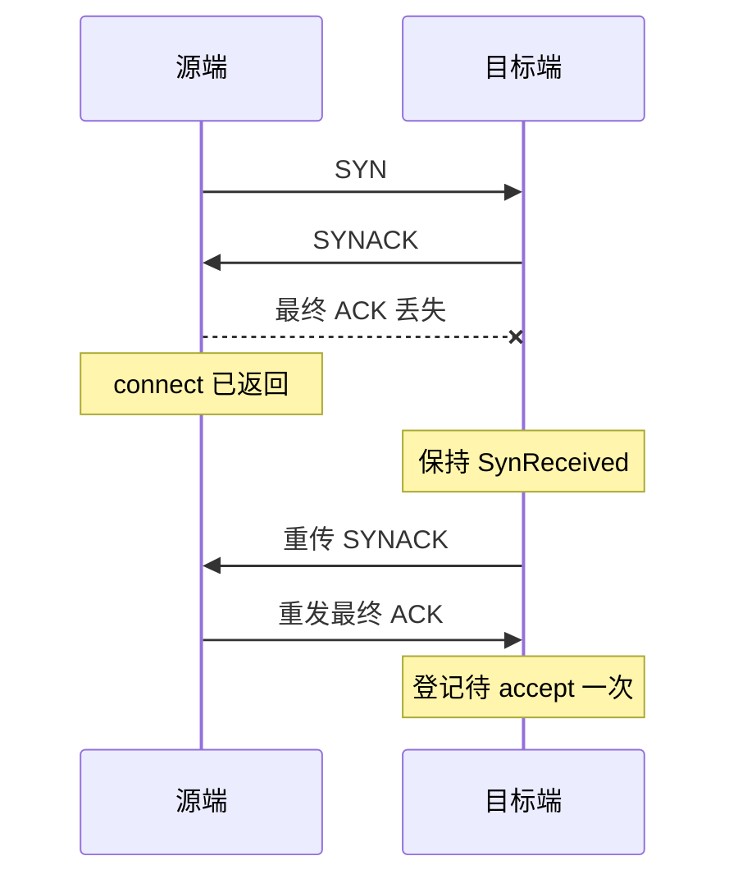

# KCP 控制报文可靠性与旧版兼容设计

日期：2026-09-14。

状态：已按本文实现并提交；当前实现、验收结果及仍未定位的异常见
[实现与验证记录](kcp-control-reliability-validation-2026-09-14.md)。
本文保留设计要求，具体通过范围以验证记录为准。

## 1. 背景与问题边界

此前已修复 TCP 代理任一方向 EOF 导致双向转发提前退出、KCP accept
通知队列满后连接交接丢失、接收缓冲排空与提前 FIN 的处理，以及握手前
心跳触发 RST 的竞态。具体版本及结果见
[半关闭验证记录](tcp-proxy-half-close-validation-2026-09-14.md)。

仍有两个问题：

1. 已证实的握手最终 ACK 丢失：源端收到 SYNACK 后认为连接建立，目标端
   仍停留在 SynReceived；服务端先发 greeting 的业务因此超时。
2. 一次未主动注入丢包的反向半关闭超时：发送端出现输出队列 Full，FIN
   已进入端点输出队列，但没有证据证明它何时到达对端。失败日志未记录
   客户端已收字节数，尚不能确定缺少的是数据、EOF，还是两者。后续
   TRACE 重跑通过，不足以消除或解释原失败。

KCP 数据传输自身的确认重传没有覆盖外层 SYN、SYNACK、握手确认和 FIN。
这是连接状态机的局部协议设计问题。修复需要明确控制报文的重复处理、
完成条件和状态寿命，无需重做 KCP 数据传输或 EasyTier 路由架构。

本设计解决已证实的握手恢复缺口，并为 FIN 增加可靠确认。同时继续调查
第二项异常；不能将新增 FIN 重传直接当作该异常已经修复的证明。

## 2. 目标、范围与不变量

目标：

- 新旧节点双向正常互通，滚动升级不得要求所有节点同时升级。
- 新节点之间，控制报文在重试预算内丢失、重复或乱序时能够恢复。
- 连接只交接一次，应用数据不重复交付，EOF 不越过已接收数据。
- 半关闭只关闭一个发送方向，另一方向仍可长期传输。
- 无法恢复时有界结束并报告错误，不能用正常 EOF 掩盖失败。
- 关闭记录、待发送控制报文和重试任务均有明确生命周期。

范围：kcp-sys 的报文定义、连接状态机、端点调度与清理、必要的流错误
传播，以及 EasyTier 的依赖 pin、集成测试和验证记录。

不新增路由能力公告、PeerFeatureFlag 字段、配置开关或应用层请求重试；
不修改 TCP flow-key 修复、QUIC 协议、KCP 数据分段和拥塞算法。保留现有
connect API、调用方超时和业务测试的 5 秒 socket 超时。

协议不变量：

1. 模式由本连接握手确定，交付应用后不能切换。
2. 握手状态变化和是否产生应答是两件事；可靠模式允许状态不变但应答。
3. 已经进入应用交接路径的连接，重复控制包不能再次 accept。
4. FIN_ACK 只确认对方 FIN，不表示自己也关闭发送方向。
5. 只有正常收到对端 FIN 且排空接收数据，才能向应用报告正常 EOF。
6. FIN 确认成功后，FIN 重试期限不能限制正常半关闭连接的寿命。
7. 重复包不能延长握手、FIN 重试和最终关闭记录的固定截止时间。

## 3. 版本基线与兼容证据

| 用途 | kcp-sys revision |
| --- | --- |
| 旧协议基线 | `d7427c22d764deb1860a7d37acc446ed5033464c` |
| 本设计实施基线，已含前述局部修复 | `b37ee660fb70bb6d816fb8bbc08b140e55e7218b` |

源码检查确认：

- 旧 header 含三个 u32、一个 flags 字节及一个 `rsv` 保留字节，总长
  14 字节；旧实现不读取 `rsv`。
- 旧 SYNACK 使用新建且清零的 header，不回显 SYN 的 `rsv`。
- 旧 FSM 收到重复 SYN 时可能构造 RST，但状态不变；外层
  `KcpConnectionState::handle_packet` 丢弃状态未变化时的输出，
  因此已检查的旧端点不会实际发送该 RST。
- `rsv` 未被读取、状态不变时抑制输出的行为，在已检查历史
  `a5f4b4e`、`37f653c`、`0f2fea1`、`9ce5c08`、`0f0a055`、
  `71eff18`、`d7427c2` 中一致。

这些是源码与历史检查，不是上述每个 revision 的运行测试。正式兼容
声明必须对应实际测试的 EasyTier 版本及其锁定依赖，不能扩展为所有
未检查的历史版本或第三方修改版本都已验证。

实现基线源码：
[报文定义](https://github.com/EasyTier/kcp-sys/blob/b37ee660fb70bb6d816fb8bbc08b140e55e7218b/src/packet_def.rs)、
[状态机](https://github.com/EasyTier/kcp-sys/blob/b37ee660fb70bb6d816fb8bbc08b140e55e7218b/src/state.rs)、
[端点](https://github.com/EasyTier/kcp-sys/blob/b37ee660fb70bb6d816fb8bbc08b140e55e7218b/src/endpoint.rs)。

## 4. 报文格式与连接内协商

### 4.1 字段定义

保持 14 字节 header、连接标识字段、已有 flags 和 KCP DATA payload
布局不变。使用已有 `rsv` 字节：

| 值 | 定义 |
| --- | --- |
| `0` | 旧协议，后文称 legacy |
| `1` | 本文可靠控制协议，后文称可靠模式 |

新增 FIN_ACK 使用 flags 当前未分配的最高位 `0x80`。它是独立报文，
flags 必须恰好为 FIN_ACK，`rsv=1`，payload 为空。不能用 FIN|ACK
表示关闭确认，因为旧端会把 FIN 位解释为对端关闭发送方向。

可靠模式报文约束：

| 报文 | flags | payload |
| --- | --- | --- |
| SYN | SYN | 原有连接元数据，重传保持完全相同 |
| SYNACK | SYN\|ACK | 空 |
| 最终握手确认 | ACK\|DATA | 空 |
| 数据及 KCP 内部确认 | ACK\|DATA | 原有 KCP payload |
| 关闭发送方向 | FIN | 空 |
| 关闭确认 | FIN_ACK (`0x80`) | 空 |
| 重置、心跳 | 原有 RST、PING、PING\|PONG | 沿用现有定义 |

可靠模式报文均带 `rsv=1`。legacy 的后续报文仍使用现有格式和 `rsv=0`；
新源端最初提出协商的 SYN 是可能发给旧目标端的唯一保留字节扩展。

只有匹配连接标识、当前握手阶段和合法 flags/payload 的 SYNACK，
才可以确认模式。不能通过 PING/PONG 确认：旧端的心跳应答会复制输入
报文，可能保留它并不理解的 `rsv`。

### 4.2 协商步骤

1. 新源端发送 SYN，`rsv=1`，进入尚未确认模式的 SynSent。
2. 新目标端收到 SYN：`rsv=1` 时回复 SYNACK `rsv=1`，记录可靠模式
   候选状态；`rsv=0` 时从头使用 legacy，回复 SYNACK `rsv=0`。
3. 旧目标端忽略 `rsv`，自然回复 SYNACK `rsv=0`。新源端收到它后，
   在交付应用前确定 legacy，最终 ACK 及后续报文都使用旧模式。
4. 新源端收到合法 SYNACK `rsv=1` 后确认可靠模式，发送最终 ACK
   `rsv=1`。目标端收到匹配模式的确认后完成握手并登记待 accept。
5. 源端继续在收到合法 SYNACK 后完成 connect，不增加第四次握手或
   额外 RTT。最终 ACK 丢失后的恢复规则见第 5 节。

未识别的 SYN `rsv` 值不得被当作可靠能力，可按不支持扩展响应 legacy
SYNACK。新源端只接受它实际支持的 SYNACK 模式 `0` 或 `1`；未知值
报告协议错误，不启用增强行为。重复 SYN 不允许更改已有连接的模式或
连接元数据。已协商可靠模式后，模式不匹配的控制包不得触发降级。

节点重启或降级后的新连接重新协商；不缓存按节点永久生效的协议模式。
不承诺跨进程重启维持既有连接。

### 4.3 初始 SYN 与旧版兼容

首个 SYN 或 SYNACK 丢失时，源端尚不可能拿到协商确认。因此 SynSent
期间允许在原截止时间内重传完全相同的 SYN，不以前置能力公告或已收到
SYNACK 为条件。

在已检查的旧端点中，重复 SYN 不引出 RST，但也不会让旧目标端重发
SYNACK。所以新源端→旧目标端仍保留旧目标端 SYNACK 丢失时的限制。
这一行为必须由真实旧依赖运行测试确认，不能只测试重写的 legacy 模型。

新目标端对旧源端保持 legacy 行为，不主动开启 SYNACK 重传。
legacy 分支继续保留“状态不变则抑制 FSM 输出”的现有行为；不得将
可靠模式的应答修复无条件套用，否则会改变旧连接的 RST 行为。

## 5. 可靠握手与重复报文

源端在 SynSent 重传 SYN，目标端在可靠 SynReceived 重传 SYNACK。
所有重传使用原连接 ID，不创建额外连接或重试业务请求。

| 当前状态 | 输入 | 动作 |
| --- | --- | --- |
| 无状态 | 合法 SYN | 保存模式与连接元数据，建立 SynReceived，回复 SYNACK |
| SynReceived | 相同 SYN | 重新回复 SYNACK，不替换状态或延长截止时间 |
| SynReceived | 匹配的 ACK\|DATA | 完成握手，登记待 accept 一次，停止 SYNACK 定时重传 |
| SynSent | 合法 SYNACK | 确定模式，发送最终 ACK，完成 connect |
| Established 或半关闭 | 重复 SYNACK | 回复最终 ACK，不重新创建流、不改变关闭状态 |
| 已握手、尚未最终释放 | 相同 SYN | 可重发原 SYNACK，不重复 accept、不恢复已关闭方向 |
| 已握手 | 重复最终 ACK | 幂等处理，不重复交接连接 |

ACK\|DATA 带有效 KCP payload 时仍按 KCP 处理。若它同时完成握手，
不得为了修复握手而重复交付 payload；必须验证 accept 前到达数据时，
现有 KCP 重传和接收路径最终完整交付字节。

最终 ACK 丢失的正常恢复：



### 5.1 最终 ACK 丢失后立即 FIN

空流的发送缓冲本来就是空的，connect 返回后可以立即 shutdown；不能
假设 FIN 一定晚于最终 ACK 到达。

可靠 SynReceived 收到匹配模式和连接标识的合法 FIN 时，将它视为
隐含的握手确认，同时执行：

1. 完成握手并停止 SYNACK 重传。
2. 登记待 accept 一次，保存对端发送方向已关闭。
3. 回复 FIN_ACK；accept 创建流时继承对端关闭状态。
4. 接收排空后报告 EOF，本端仍可回复数据。

不能先进入 Closed 再返回 RST，也不能要求应用先发送非空数据才能
完成握手。该规则仅用于可靠模式。

## 6. FIN、确认与双向关闭

### 6.1 本端关闭发送方向

保留现有顺序：应用关闭发送队列，发送任务把排队数据交给 KCP，并等待
`waitsnd == 0`，然后进入 FIN 待确认阶段。重试预算从这一阶段开始计算，
不能从应用开始传输或尚未排空数据时开始计算。

FIN 发送入队成功不代表对端已收到。记录待确认状态、下一次重传时间和
固定截止时间，直到收到有效 FIN_ACK 或连接明确失败。收到对端 FIN
本身不等同于本端 FIN 已被确认。

保留现有 AsyncWrite shutdown 的本地关闭语义，不将其返回成功解释为
对端已确认。关闭确认和最终回收由端点负责；后续超时通过仍存活的流和
诊断状态表达，不能变成伪造的正常 EOF。

### 6.2 收到 FIN 或 FIN_ACK

- 收到 FIN：记录对端发送方向已关闭，并安排 FIN_ACK。接收任务仍需
  把已确认接收的数据交给应用，排空后才产生 EOF。
- FIN_ACK 可以先于应用读完数据发送；它确认端点收到了 FIN，不确认
  应用已经消费数据。因此接收状态和缓冲生命周期不能随确认提前删除。
- 重复 FIN：重复应答 FIN_ACK，不重复产生应用 EOF，不重置连接。
- 收到 FIN_ACK：仅当本端确实已经发送 FIN，且模式、连接标识、flags
  和 payload 全部合法时，停止本端 FIN 重传。
- 提前、重复或与当前阶段无关的 FIN_ACK 不推进状态、不关闭写方向。

发送和接收两个方向分别记录完成情况。现有 Established、LocalClosed、
PeerClosed、Closed 不足以单独表达“本端 FIN 已发但未确认”，应在现有
连接状态内补足该信息，不另建一套连接所有权或通用重试框架。

### 6.3 正常回收与短暂关闭记录

可靠模式最终回收分两步：

1. 本端 FIN 已确认、对端 FIN 已收到，并且接收任务排空后，释放 KCP
   数据对象、应用通道和数据任务；在原 state_map 保留最小关闭记录。
2. 固定保留期结束后删除该记录。重复报文不延长保留期。

关闭记录仅保存原连接 ID、协议模式、正常关闭原因、回复重复 FIN 所需
信息和过期时间。它继续回复 FIN_ACK；合法在途 PING/PONG 可以忽略，
不得因现有 Closed 心跳路径而回复 RST。迟到 SYN/SYNACK 不得重新
accept、创建数据对象或恢复连接；已经完成的数据包可以丢弃。

双方同时关闭时，即使只有一方收到 FIN_ACK，先完成的一方也要依靠该
记录继续回答另一方的 FIN 重传。不能沿用“Closed 且 recv_done 就立即
删除所有状态”的判断。

legacy 继续使用原有回收规则。可靠模式的短暂记录会使状态表在有限
时间内多保留条目，容量验收必须单独计算，不能继续要求所有内部状态
在原 15 秒观察点清零。

## 7. 定时、队列与失败路径

### 7.1 拟定默认参数

以下为实现初值，需由定点丢包与延迟测试验证后固定；调整须在验证记录
说明，不能为了让测试通过而延长业务超时。

| 参数 | 初值 / 规则 |
| --- | --- |
| SYN、SYNACK、FIN 首次重传间隔 | 200 ms |
| 后续重传 | 指数退避，单次间隔上限 2 s |
| 源端握手期限 | 调用方现有 `connect(timeout_dur)`，不延长 |
| 可靠目标端握手期限 | 首次收到 SYN 后 60 s，不由心跳或重复包续期 |
| FIN 待确认期限 | 进入 FIN 阶段后 60 s |
| 正常关闭记录保留期 | 65 s，覆盖 FIN 重试窗口并留调度余量 |

目标端和 FIN 的 60 秒预算是端点控制状态的资源边界，不替代应用更短的
超时。网络永久不可达时，正确结果是可诊断的超时和最终清理。

关闭记录保留期必须不少于另一端允许的最大 FIN 重试窗口加余量，因此
FIN 期限不能变成各端任意可调且互不知情的参数。若后续版本改变这些
上界，需要重新审查版本间兼容性。

FIN 已确认后立即解除 FIN 重试期限；正常半关闭继续按既有连接存活规则
处理。仅本端 FIN 未确认才受该期限限制，反向有数据或 PONG 也不能使
未确认 FIN 无限续期。

### 7.2 端点调度与输出队列

使用单个端点控制调度任务和现有 state_map；不为每次重传创建任务，不
扩容或改成无界队列。按最近的控制截止时间唤醒，新状态通过通知更新
调度；没有待处理控制状态时，避免对全部空闲连接进行高频扫描。

状态记录是控制报文待处理事实的来源。输出队列暂满时保留该事实，稍后
再尝试；不能像原 accept 通知一样丢失后就再无恢复机会。

- 用短临界区和非阻塞入队，禁止持有 state_map/conn_map 锁跨 await。
- 每次实际入队前重新检查状态、连接标识和期限，防止陈旧重传在取消或
  回收后继续发送。回收不能与入队检查形成复活旧连接的竞态。
- SYN/SYNACK/FIN 的重传受各自固定预算限制。重复请求所需的 ACK 或
  FIN_ACK 应答可合并为待发状态，不能累计无界报文列表。
- 应答暂时无法入队时由调度器继续尝试；应答不会获得独立的无限寿命。
  合并应答记录从首次待发起最多保留 60 秒，重复请求不续期；正常关闭
  记录中的应答还受该记录更早的截止时间限制。入队成功即撤销待发标记。
  单纯的应答待发过期只清除该应答，不因此关闭仍合法存活的连接；请求
  发送方最终依靠自身握手或 FIN 重试期限判定成功或失败。
- 队列满不能阻塞整个控制调度任务，也不能阻止它处理其他连接的截止
  时间。不得把“尝试入队成功”统计成“对端确认成功”。

### 7.3 取消、错误与连接 ID

- connect future 取消或超时：撤销该连接的重试与本地所有权；目标端
  未完成握手的状态按其固定期限退出，重复包不能延长。
- 有效 RST、端点销毁或 FIN 重试耗尽：停止控制重试、唤醒等待任务，
  保留错误与正常 EOF 的区别。只发送必要的现有重置通知，不建立 RST
  确认和重试协议。
- 清理失败连接不能重新产生待 accept；迟到的控制响应不能恢复已取消
  的 connect future。
- ConnId 分配必须避开所有仍有效的状态，包括正常关闭记录。回绕不能
  复用仍在保留期内的 ID；会话标识变化后，旧报文不得作用于新会话。
- 保留期之后无限迟到的包不在可靠恢复窗口内。不得通过永久保存关闭
  记录来试图覆盖无界的网络延迟。

## 8. 兼容性矩阵与降级

| 源端 | 目标端 | 预期模式 | 必须满足 |
| --- | --- | --- | --- |
| 旧 | 旧 | legacy | 对照基线，保留既有行为 |
| 新 | 旧 | SYNACK `rsv=0` 确定 legacy | 正常互通，不发 FIN_ACK，不要求目标支持新确认 |
| 旧 | 新 | 从 SYN `rsv=0` 确定 legacy | 正常互通，不主动开启新 SYNACK/FIN 重传语义 |
| 新 | 新 | 本连接握手确认可靠模式 | 握手与关闭在重试预算内恢复 |

兼容的含义是旧节点仍可互通，且混合组合不因新代码发生行为退化。它不
意味着旧目标端自动获得 accept 修复，或旧连接获得其未实现的 ACK/FIN
恢复能力。必须把遗留失败与新增失败分别记录。

发布或回退影响后续新连接的协商。协议模式固定在连接内，禁止基于后续
路由公告变化对活跃连接进行升级或降级。旧可执行程序重启后不承担继续
解释原进程可靠模式连接的义务。

## 9. 实施拆分

实施使用独立协议修复分支，以 `b37ee660` 及 EasyTier 当前已验证修复
为基线，不将协议改动混入原 TCP flow-key patch。

1. **先建立兼容测试夹具。** 使用实际旧依赖和当前基线端点，确认 `rsv`
   处理、旧 SYNACK、重复 SYN 和旧模式输出门控。明确失败基线。
2. **实现协商及状态处理。** 增加模式、合法报文校验、可靠模式幂等应答，
   保留 legacy 路径。补上最终 ACK 丢失加立即 FIN 的交叉状态。
3. **实现统一控制调度及可靠关闭。** 补足握手/FIN 期限、FIN_ACK、正常
   关闭记录、队列暂满、取消和错误清理。
4. **完成依赖验证后接入 EasyTier。** 更新依赖 pin 与锁文件，运行真实
   代理路径、混合版本和跨平台验证，提交可追溯记录。

协商声明代表完整可靠控制协议，不能在只实现握手恢复、尚未实现 FIN_ACK
时对外声明 `rsv=1`。中间提交可以用于审阅，但仅完整实现且验证通过的
依赖版本可被 EasyTier 发布使用。

代码主要落点为 kcp-sys 的 `packet_def.rs`、`state.rs`、`endpoint.rs`，
按实际错误传播需要调整 `stream.rs`；不预先拆出通用协议框架。EasyTier
预计只需依赖更新、测试和记录，不需要修改 protobuf 或节点能力公告。

## 10. 验证与验收标准

### 10.1 确定性协议测试

在端点输入/输出之间设置测试用报文过滤器，按连接 ID、报文类型和次数
精确丢弃、延迟或重复报文。可使用可控时钟测试期限，不依赖随机 netem
才能触发边界，也不通过扩大生产超时使测试通过。

| 场景 | 验收断言 |
| --- | --- |
| 分别丢首个 SYN、SYNACK、最终 ACK | 新新组合恢复，同一连接只交接一次 |
| 连续丢多次控制包后恢复链路 | 截止时间内恢复，重试次数与退避符合预期 |
| 最终 ACK 丢失后空流立即 FIN | 目标完成握手、返回 EOF、仍能回复数据，无 RST |
| 最终 ACK 丢失后首个 DATA 到达 | 正确完成握手，应用字节完整且不重复 |
| 重复 SYN/SYNACK/ACK，含半关闭阶段 | 不重复创建连接，不恢复已经关闭的方向 |
| 丢单向 FIN 或 FIN_ACK | 重传恢复；确认不关闭另一方向 |
| 双方同时 FIN，单侧或双侧确认丢失 | 正确排空，正常关闭记录继续应答，最终回收 |
| FIN 先于 accept 或 connect 返回 | 空请求、空响应均正确得到 EOF |
| 接收缓冲尚未被应用读完 | FIN_ACK 不导致缓冲和数据任务提前释放 |
| FIN 已确认后持续半关闭超过 60 s | 反向仍可传输，不受 FIN 期限误杀 |
| 正常关闭记录收到重复 FIN、旧心跳 | 应答或忽略，无 RST，不延长固定保留期 |
| SYN/FIN 永久丢失、控制输出队列长时间满 | 到期退出，无无限任务或状态残留 |
| 队列临时满后恢复 | 待发事实不丢失，其他连接和清理继续运行 |
| connect 取消、RST、端点销毁与重试并发 | 不复活旧状态，等待者正确结束，无伪 EOF |
| ConnId 回绕、会话变化、迟到报文 | 不命中仍在保留期的旧 ID，不污染新会话 |

### 10.2 真实旧版兼容测试

测试夹具必须运行旧依赖的真实 endpoint，不能只在新实现上设置 legacy
标志代替旧版本。首次验收覆盖 `d7427c2`、`b37ee660` 与新实现的组合，
并记录 EasyTier 发布验证实际选用的旧二进制版本和哈希。

除四种组合的双向数据与关闭外，额外断言：

- 旧端收到 SYN `rsv=1` 仍按旧协议回复 SYNACK `rsv=0`。
- 重复 SYN 不引出混合连接新增 RST；legacy 输出门控保持原有行为。
- 混合组合捕获不到 FIN_ACK；旧端不必识别任何新控制语义。
- PING/PONG、错误连接 ID、非法 flags 或未知 SYNACK 模式不能确认能力。
- 新连接在节点升级、回退后重新选择正确模式，不沿用节点级缓存。
- 旧版原有半关闭或丢包失败作为对照保留，不将它们写成新协议已通过。

### 10.3 EasyTier 流量与平台验证

Linux 需要 root 的测试在现有 `rust` 容器中运行。复用正常 target，权限
问题通过修复所有权解决，不另开编译目录。

- 完整三节点组合及 ACL、配置更新、端口转发、断连测试。
- TCP/KCP/QUIC × 内核/smoltcp 六种模式，检查未修改协议没有退化。
- 每组合 300 次短连接、16 并发、5 秒 socket 超时；KCP 每栈追加三轮，
  与已有每版本 2,400 次 KCP 结果对照。
- 空请求、256 KiB 请求后 EOF、1 MiB 响应，以及服务端先半关闭后客户端
  才发送 256 KiB 的反向场景，均逐字节核对。
- `netem delay 10ms 3ms loss 1%` 下持续双连接与短连接；定点控制包丢失
  由协议测试证明，随机丢包实验用于验证整体行为。
- 新旧两方向真实二进制互通；无丢包与丢包结果分别记录。
- Linux、macOS、Windows 原生依赖测试及网关测试；格式与严格 Clippy。
  缺少组件、未运行的项目不得记录为通过。

### 10.4 未解释的反向超时

复现脚本必须记录超时时已收到的字节数、是否收到 EOF、源端口、连接 ID，
并在双方记录 FIN/FIN_ACK 的入队、发送和接收时间。补足原失败缺少的
证据，区分数据缺失、关闭通知缺失、队列延迟和状态处理错误。

恢复实际链路的 FIN 丢失，只能证明这一类注入故障已修复；仍需解释原
异常或明确保留未定位项。不得用重跑通过覆盖原始失败。

### 10.5 资源与交付门槛

分别统计：应用代理连接、KCP 数据对象、半开握手、未确认 FIN、正常关闭
记录、FD 和 RSS。保留期内的轻量记录属于设计成本，不能混同于活跃连接
泄漏；其数量约受每秒关闭连接数乘以保留期约束，需实测内存成本。

静止并超过握手/FIN 期限及关闭记录保留期后，所有应回收状态必须消失。
使用重复负载周期检查资源是否持续累积，并检查端点空闲及大量并发时
控制调度的 CPU 成本。不能仅凭一次 FD 回到基线宣布不存在泄漏。

交付必须满足：确定性恢复用例通过；实际旧版兼容用例没有新增失败；
错误路径有界清理；原有矩阵没有新退化；所有异常如实保留。完整最终
代码 diff 由独立子代理审查，只处理高置信度真实缺陷。验证记录绑定
提交、依赖 revision、二进制哈希、准确命令及原始日志。

## 11. 当前进度与证据

已完成：连接级版本协商、握手与 FIN 恢复、FIN_ACK、重复控制处理、
正常关闭记录、队列饱和处理与取消清理。kcp-sys 最终提交为
`3ef5c4161faf99940f3ed51efd43cef0cbc02b4f`，EasyTier 最终依赖接入为
`ee02b8f7`。首次验收已测试真实旧实现 `d7427c2` 和 `b37ee660`。
后续测试整理仅保留 `d7427c2` 长期基线；当前维护版本与依赖 pin 见
[实现与验证记录](kcp-control-reliability-validation-2026-09-14.md)。

三平台原生依赖测试、Linux 完整矩阵及实际流量的本轮结果单独记录，
不沿用上一轮局部修复的通过数。最终代码审查没有 blocker / major，
一项首次 SYNACK 调度竞态 minor 按用户规则记录待办。

仍需保留的边界：原反向超时没有足够证据做最终归因；混合版本保留
legacy 的控制恢复限制；有限负载和应用级资源采样不能代替生产规模
长期内存、CPU 和容量验证。所有实测异常及未执行项见关联验证记录。

此前调查原始产物位于：

```text
/data/project/proxy-close-validation-20260914/
```

关键证据：`remaining-loss-handshake.md`、`loss-handshake-evidence.log`、
`delivery-reverse-timeout.md`、`fin-send-path-old-new.txt`、
`delivery-manifest.json`、`traffic-summary.md`。上述绝对路径是本机
调查产物位置；仓库读者可通过关联验证记录了解结论与证据限制。
