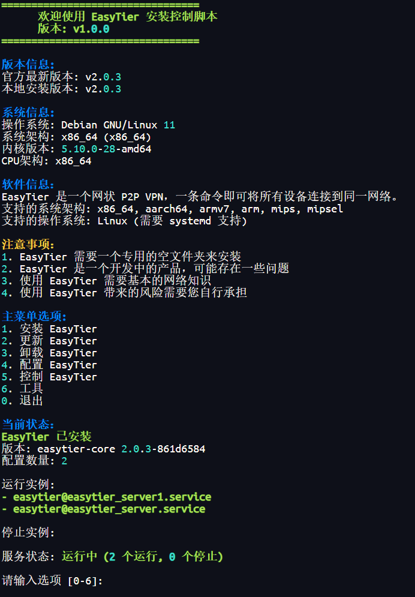
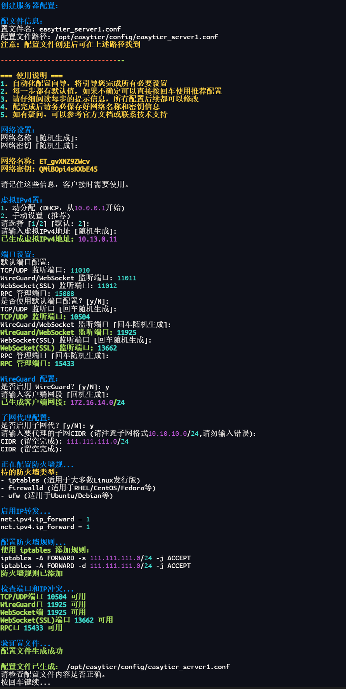

# EasyTier 配置管理脚本

这是一个用于管理 EasyTier 配置的 Shell 脚本集合。

EasyTier 是一个简单、安全、去中心化的内网穿透 VPN 组网方案，使用 Rust 语言和 Tokio 框架实现。

* 去中心化：无需依赖中心化服务，节点平等且独立。
* 安全：支持利用 WireGuard 加密通信，也支持 AES-GCM 加密保护中转流量。
* 高性能：全链路零拷贝，性能与主流组网软件相当。
* 跨平台：支持 MacOS/Linux/Windows/FreeBSD/Android，未来将支持 IOS。可执行文件静态链接，部署简单。
* 无公网 IP 组网：支持利用共享的公网节点组网，可参考 配置指南
* NAT 穿透：支持基于 UDP 的 NAT 穿透，即使在复杂的网络环境下也能建立稳定的连接。
* 子网代理（点对网）：节点可以将可访问的网段作为代理暴露给 VPN 子网，允许其他节点通过该节点访问这些子网。
* 智能路由：根据流量智能选择链路，减少延迟，提高吞吐量。
* TCP 支持：在 UDP 受限的情况下，通过并发 TCP 链接提供可靠的数据传输，优化性能。
* 高可用性：支持多路径和在检测到高丢包率或网络错误时切换到健康路径。
* IPV6 支持：支持利用 IPV6 组网。
* \

## 系统要求

* 支持的系统：Linux (需要 systemd)
* 支持的架构：x86_64, aarch64, armv7, arm, mips, mipsel
* 需要 root 权限运行

## 安装方法

使用以下任一命令安装：


##  jsdelivr CDN 镜像源

```javascript
bash <(curl -sL https://gcore.jsdelivr.net/gh/CGG888/EasyTier/script/easytier.sh)
bash <(curl -sL https://fastly.jsdelivr.net/gh/CGG888/EasyTier/script/easytier.sh)
bash <(curl -sL https://testingcf.jsdelivr.net/gh/CGG888/EasyTier/script/easytier.sh)
bash <(curl -sL https://quantil.jsdelivr.net/gh/CGG888/EasyTier/script/easytier.sh)
```

#### 使用国内镜像加速

```bash
bash <(curl -sL https://ghp.ci/https://raw.githubusercontent.com/CGG888/EasyTier/main/script/easytier.sh)
```


备用镜像

```bash
bash <(curl -sL https://mirror.ghproxy.com/https://raw.githubusercontent.com/CGG888/EasyTier/main/script/easytier.sh)
```


```javascript
bash <(curl -sL https://hub.gitmirror.com/https://raw.githubusercontent.com/CGG888/EasyTier/main/script/easytier.sh)
```


```bash
bash <(curl -sL https://gh.ddlc.top/https://raw.githubusercontent.com/CGG888/EasyTier/main/script/easytier.sh)
```


```javascript
bash <(curl -sL https://gh.api.99988866.xyz/https://raw.githubusercontent.com/CGG888/EasyTier/main/script/easytier.sh)
```


Github地址：


```javascript
bash <(curl -sL https://raw.githubusercontent.com/CGG888/EasyTier/main/script/easytier.sh)
```


## 功能特性

* 创建和管理 EasyTier 配置
* 支持服务器模式、客户端模式和公共服务器模式
* 自动生成和管理 systemd 服务文件
* 配置文件备份和恢复
* WireGuard 配置生成和管理
* 支持配置二维码生成（PNG格式和终端显示）

## 配置模式


1. 服务器模式
   * 创建私有网络节点服务器
   * 适合拥有公网IP的服务器
   * 支持 WireGuard 配置生成
2. 客户端模式
   * 连接到现有网络节点
   * 支持连接私有服务器或社区公共节点
   * 支持 WireGuard 客户端配置
3. 公共服务器模式
   * 加入公共服务器节点集群
   * 适合具有稳定公网IP的服务器

## WireGuard 支持

* 自动生成 WireGuard 配置文件
* 配置文件保存在 /opt/easytier/wireguard/ 目录
* 支持生成二维码（需要安装 qrencode）
  * PNG 格式二维码保存在 /opt/easytier/wireguard/ 目录
  * 支持在终端直接显示二维码
* 配置文件命名格式：{config_name}_wg.conf
* 二维码文件命名格式：{config_name}_wg.png

## 使用说明


1. 配置管理   `bash ./easytier.sh   `
2. 创建新配置
   * 选择配置模式（服务器/客户端/公共服务器）
   * 按照提示输入必要信息
   * 配置文件将自动生成并保存
3. WireGuard 配置
   * 在创建配置时选择启用 WireGuard
   * 配置文件和二维码将自动生成
   * 可以通过手机扫描二维码快速导入配置

## 文件位置

* 主程序目录：/opt/easytier/
* 配置文件：/opt/easytier/config/
* WireGuard配置：/opt/easytier/wireguard/
* 服务文件：/etc/systemd/system/easytier@\*.service
* 备份文件：$HOME/.easytier_backup/

## 依赖

* systemd
* curl
* qrencode (用于生成 WireGuard 配置二维码)

## 注意事项


1. 请确保系统已安装所需依赖
2. WireGuard 配置生成需要安装 qrencode
3. 建议定期备份重要配置
4. 修改配置后需要重启相应服务
5. 请妥善保管网络密钥和配置信息

## 使用建议


1. 服务器部署：
   * 选择具有公网IP的服务器
   * 确保防火墙开放相应端口
   * 建议使用服务器模式或公共服务器模式
2. 客户端使用：
   * 根据需求选择合适的模式
   * 记录网络名称和密钥信息
   * 可以使用多种协议连接
3. 网络优化：
   * 合理设置MTU值
   * 选择合适的连接协议
   * 必要时启用延迟优先模式

## 常见问题


1. 无法连接服务器？
   * 检查网络名称和密钥是否正确
   * 确认服务器端口是否开放
   * 验证服务器是否正常运行
2. 连接速度慢？
   * 尝试不同的连接协议
   * 启用延迟优先模式
   * 选择地理位置较近的节点
3. 配置文件在哪里？
   * 默认路径：/opt/easytier/config/
   * 所有配置文件以 .conf 结尾
   * 可以通过配置管理功能查看

## 技术支持

如有问题，请访问：

* GitHub: https://github.com/EasyTier/EasyTier https://github.com/CGG888/EasyTier/blob/main/script/README.md
* 官网：https://www.easytier.top

## 许可证

MIT License


## 更新说明

### 最新版本 v1.0.0 (2024-11-14)

#### 新增功能

* 添加镜像源速度测试功能
  * 自动检测并选择最快的镜像源
  * 显示所有镜像源的响应时间
  * 优先使用速度最快的镜像源加载脚本
* WireGuard 配置优化
  * 改进配置文件格式
  * 优化二维码生成位置
  * 支持终端显示二维码
* 新增 jsdelivr CDN 镜像源支持
  * [gcore.jsdelivr.net](http://gcore.jsdelivr.net)
  * [fastly.jsdelivr.net](http://fastly.jsdelivr.net)
  * [testingcf.jsdelivr.net](http://testingcf.jsdelivr.net)
  * [quantil.jsdelivr.net](http://quantil.jsdelivr.net)
* 更新社区公共节点
  * 暂时手动更新，后续自动获取社区公共节点列表
  * 显示格式调整
  * 增加社区公共节点数量
* 修正脚本一些错别字
 
#### 优化改进

* 优化镜像源访问机制
  * 添加镜像源可用性检测
  * 自动跳过不可用的镜像源
  * 显示镜像源加载状态
* 改进配置文件管理
  * 统一配置文件存储位置
  * 优化配置文件命名规则
  * 增强配置文件备份功能

#### 修复问题

* 修复 WireGuard 配置格式问题
* 修复镜像源访问失败的处理
* 修复配置文件权限设置

#### 安装说明

* 支持多种安装方式
* 提供多个镜像源选择
* 自动选择最快的镜像源
* 优化安装过程的稳定性


\
 

 

 